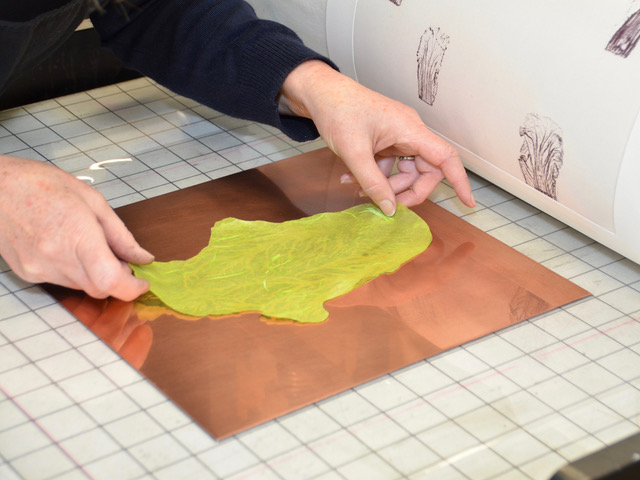
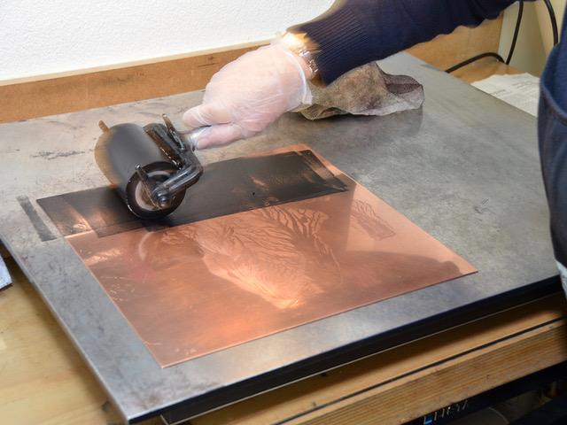
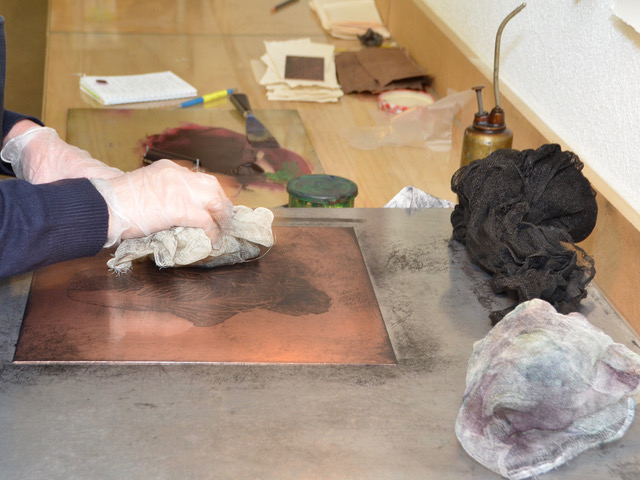
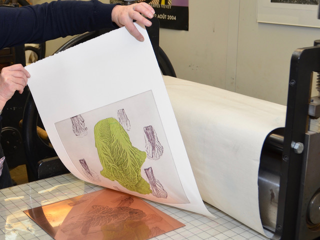

# Kupferdruck · Radierung

### Franziska Schiratzki

 
 
 
 

■■■ = noch fehlend/todo

# ■■■ TITEL

<!-- ### Rudolf Barmettler -->

## Kursbeschreibung

*■■■ umarbeiten zu Textform ■■■*

* Erlernen der technischen und handwerklichen Grundlagen des klassischen Tiefdrucks
* Kennenlernen der Eigenschaften und Anwendungsmöglichkeiten de Kupferdrucktechnik als bildnerisches Ausdrucksmittel.
* Prozesshafte Umsetzung an eigenen Arbeiten.
* Freies und individuelles Forschen und Experimentieren in Bild und Druck nach eigenen Inhalten, Themen, Vorlagen und Interessen.
* Selbstständige Realisation eines persönlichen Projektes vom Entwurf bis zum selbständigen Drucken einer kleinen Auflage.
* Förderung und Entwicklung einer eigenen künstlerischen Ausdrucksweise mit individueller Begleitung und Betreuung während des ganzen gestalterischen Prozesses.
* Professionelle Aneignung der nötigen technisch-handwerklichen Fertigkeiten von der Bearbeitung der Druckvorlage über den Umgang mit Material bis zum fachlichen Umgang mit Technik, Maschinen und Chemie.

## Bilder

## Gestalterische Fragestellungen und Prinzipien

* Bildentwicklung als Bildmetamorphose auf der immer gleichen Kupferplatte.
* Serielles Arbeiten zu einem ausgewählten Thema.
* Handwerk, Technik und gestalterischer Prozess werden Hand in Hand gelernt und angewandt.
* Bildfindung, Bildideen und Experiment entwickeln sich individuell, schrittweise und prozesshaft.
* begleitet wird individuell und persönlich
* es wird Bezug genommen zu klassischer und zeitgenössischer Druckgrafik

## Kurzbio
### Franziska Schiratzki · [Website](http://www.schiratzki.ch/)

*■■■ umarbeiten zu Textform ■■■*

### 1960
* geboren in Berlin

### 1981 - 1984
* Studium an der Universität Zürich, Ethnologie und spanische Literatur

### 1985
* Aufenthalt in Spanien, Sprachdiplom an der Universität Salamanca

### 1986 – 1990
* Kunststudium an der Ecole Supérieure d’Art Visuel, Genf Diplom in ‚expression graphique’

### 1990 – 1994
* Kupferdruckerin in den Ateliers:
  * atelier de taille-douce et lithografie, St.Prex
  * centre genèvois de la gravure contemporaine, Genève Atelier Peter Kneubühler, Zürich

### Seit 1996
Lehrerin und Dozentin für Druckgrafik Schule für Gestaltung Zürich
* Schule für Gestaltung Basel
* Hochschule für Gestaltung und Kunst Basel
* Visarte Mitglied
* Eigenes Kupferdruckatelier in Zürich

### Seit 1978
Ausstellungen im In- und Ausland

## Interview

→ Kontakt mit Susanne Hauser Lendenmann herstellen.

